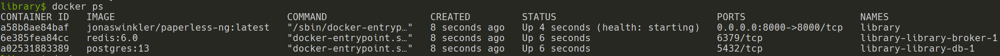
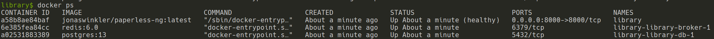

# Library

## Overview

The Library is a digital documents organizer powered by [Paperless-ngx](https://github.com/paperless-ngx/paperless-ngx).

- [Library](#library)
  - [Overview](#overview)
  - [Setup](#setup)
  - [Backup And Restore](#backup-and-restore)
    - [Content Backup](#content-backup)
    - [Content Restore](#content-restore)
    - [Database Data](#database-data)
      - [Database Backup](#database-backup)
        - [Legacy Database Backup](#legacy-database-backup)
      - [Database Restore](#database-restore)
        - [Legacy Database Restore](#legacy-database-restore)
  - [Additional Commands](#additional-commands)
    - [Create Superuser](#create-superuser)
  - [Docker-Compose Documentation](#docker-compose-documentation)

## Setup

1. Copy `.env.sample` to `.env` and update specified values.
2. Copy `docker-compose.env.sample` to `docker-compose.env` and configure as necessary.
3. Copy `docker-compose.yml.sample` to `docker-compose.yml` and configure as necessary.
4. Spin up the application with: `docker-compose up -d`
5. Verify containers are ready by checking the healthcheck: `docker ps`
    - Containers still starting:
    
    - Containers ready:
    
6. By default, try to the load the application by navigating to <http://localhost:8000/>.

## Backup And Restore

### Content Backup

```bash
docker-compose exec -T library document_exporter ../export
tar -czvf export.$(date +%Y-%m-%d).tar.gz -C export .
```

### Content Restore

```bash
tar -xzvf export.BACKUP_DATE.tar.gz -C export
docker-compose exec -T library document_importer ../export
```

### Database Data

The following database data operations assume the `docker-compose.yml` is being executed from a root directory `library`; hence the volume name: `library_library-db-data`

If this is not the case, adjust the volume name accordingly: `[DOCKER_COMPOSE_PARENT_FOLDER_NAME]_library-db-data`

The commands constructed are based on the following resources:

- <https://docs.docker.com/storage/volumes/#backup-restore-or-migrate-data-volumes>
- <https://stackoverflow.com/a/23778599>
- <https://stackoverflow.com/a/39125414>

#### Database Backup

```bash
docker run --rm --volume library_library-db-data:/backup-migration --volume /$(pwd)/backup:/backup ubuntu bash -c "cd /backup && tar czvf backup.BACKUP_DATE.tar.gz /backup-migration"
```

##### Legacy Database Backup

```bash
tar -czvf db.$(date +%Y-%m-%d).tar.gz -C db .
```

#### Database Restore

```bash
docker run --rm --volume library_library-db-data:/backup-migration --volume /$(pwd)/backup:/backup ubuntu bash -c "cd /backup-migration && tar xzvf /backup/backup.BACKUP_DATE.tar.gz --strip 1"
```

##### Legacy Database Restore

```bash
tar -xzvf db.BACKUP_DATE.tar.gz -C db
```

## Additional Commands

### Create Superuser

```bash
docker-compose run --rm library createsuperuser
```

## Docker-Compose Documentation

The following snippet was cut from the original `docker-compose.yml` provided by Paperless-ngx:

```plain
docker-compose file for running paperless from the Docker Hub.
This file contains everything paperless needs to run.
Paperless supports amd64, arm and arm64 hardware.

All compose files of paperless configure paperless in the following way:

- Paperless is (re)started on system boot, if it was running before shutdown.
- Docker volumes for storing data are managed by Docker.
- Folders for importing and exporting files are created in the same directory
  as this file and mounted to the correct folders inside the container.
- Paperless listens on port 8000.

In addition to that, this docker-compose file adds the following optional
configurations:

- Instead of SQLite (default), PostgreSQL is used as the database server.

To install and update paperless with this file, do the following:

- Copy this file as 'docker-compose.yml' and the files 'docker-compose.env'
  and '.env' into a folder.
- Run 'docker-compose pull'.
- Run 'docker-compose run --rm webserver createsuperuser' to create a user.
- Run 'docker-compose up -d'.

For more extensive installation and update instructions, refer to the
documentation.
```
