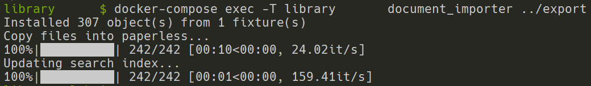
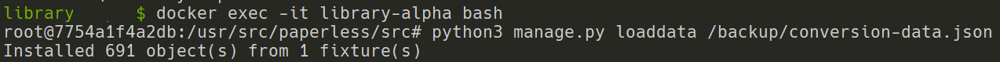

# Library

## Overview

The Library is a digital documents organizer powered by [Paperless-ngx](https://github.com/paperless-ngx/paperless-ngx).

- [Library](#library)
  - [Overview](#overview)
  - [Setup](#setup)
  - [Backup](#backup)
    - [Content Backup](#content-backup)
    - [Database Backup](#database-backup)
  - [Restore/Migration](#restoremigration)
    - [Content Restore](#content-restore)
    - [Database Restore](#database-restore)
  - [Additional Commands](#additional-commands)
    - [Create Superuser](#create-superuser)
    - [Convert Postgres to SQLite](#convert-postgres-to-sqlite)
  - [Docker-Compose Documentation](#docker-compose-documentation)

## Setup

1. Copy `docker-compose.env.sample` to `docker-compose.env` and configure as necessary.
2. Copy `docker-compose.yml.sample` to `docker-compose.yml` and configure as necessary.
3. Spin up the application with: `docker-compose up -d`
4. Verify containers are ready by checking the healthcheck: `docker ps`
    - Containers still starting:
    
    - Containers ready:
    
5. By default, try to the load the application by navigating to <http://localhost:8000/>.

## Backup

### Content Backup

```bash
rm -rf export/*
docker-compose exec -T library document_exporter ../export
tar -czvf backup/export.$(date +%Y-%m-%d).tar.gz -C export .
```

### Database Backup

```bash
docker exec -it library-db bash -c "pg_dump -U \$POSTGRES_USER \$POSTGRES_DB > /backup/database.$(date +%Y-%m-%d).sql"
```

The resulting backup can then be found at `backup/database.[BACKUP-DATE].sql`.

## Restore/Migration

1. Clone repository (if not done already) and `cd` into the directory.
2. Setup the application ([Setup](#Setup)).
3. Spin up the application and wait for a `healthy`: `docker-compose up -d`
4. Ensure the target `export` and `database` backup files have been dropped into the `backukp` folder.
5. [Restore content](#content-restore)
6. [Restore database](#database-restore)

### Content Restore

```bash
rm -rf export/*
tar -xzvf backup/export.BACKUP_DATE.tar.gz -C export
docker-compose exec -T library document_importer ../export
```

When importing, the following progress bar should be displayed:


### Database Restore

```bash
docker exec -it library-db bash -c "dropdb -U \$POSTGRES_USER \$POSTGRES_DB && createdb -U \$POSTGRES_USER \$POSTGRES_DB && psql -U \$POSTGRES_USER \$POSTGRES_DB < /backup/database.[BACKUP-DATE]"
```

Note: if the following error arises:

```plain
dropdb: error: database removal failed: ERROR:  database "paperless" is being accessed by other users
DETAIL:  There are 3 other sessions using the database.
```

Stop all containers and spin up only the database container and immediately re-run the import command:

```bash
docker-compose stop
docker-compose up -d library-db
# Re-run import command above.

# Then spin all containers up.
docker-compose up -d
```

## Additional Commands

### Create Superuser

```bash
docker-compose run --rm library createsuperuser
```

### Convert Postgres to SQLite

The Paperless-NGX documentation has instructions for converting a [SQLite database to Postgres](<https://paperless-ngx.readthedocs.io/en/latest/setup.html#moving-data-from-sqlite-to-postgresql>), and while not explicitly stated, the reverse process works for converting a Postgres database to SQLite as discussed [here](<https://github.com/jonaswinkler/paperless-ng/issues/1550#issuecomment-1015784199>).

Please see below for the steps used for this conversion (Postgres -> SQLite).

```bash
# Spin up application.
# Note: if necessary, ensure a temporary mount is made in order to persist the conversion file between container creations.
docker-compose up -d

# Hook into the `library` container and run the data export command. Once exported, exit the container.
docker exec -it library bash
python3 manage.py dumpdata --exclude=contenttypes --exclude=auth.Permission > /backup/conversion-data.json
exit

# Update the docker-compose.yml file to replace the Postgres database config and references with SQLite:
# https://github.com/paperless-ngx/paperless-ngx/blob/main/docker/compose/docker-compose.sqlite.yml

# Re-spin up the containers. The `library` container should be recreated.
docker-compose up -d

# Hook into the container again and run the data import command.
docker exec -it library bash
python3 manage.py loaddata /backup/conversion-data.json
exit
```

Once imported, a confirmation message should be displayed as follows:


## Docker-Compose Documentation

The following snippet was cut from the original `docker-compose.yml` provided by Paperless-ngx:

```plain
docker-compose file for running paperless from the Docker Hub.
This file contains everything paperless needs to run.
Paperless supports amd64, arm and arm64 hardware.

All compose files of paperless configure paperless in the following way:

- Paperless is (re)started on system boot, if it was running before shutdown.
- Docker volumes for storing data are managed by Docker.
- Folders for importing and exporting files are created in the same directory
  as this file and mounted to the correct folders inside the container.
- Paperless listens on port 8000.

In addition to that, this docker-compose file adds the following optional
configurations:

- Instead of SQLite (default), PostgreSQL is used as the database server.

To install and update paperless with this file, do the following:

- Copy this file as 'docker-compose.yml' and the files 'docker-compose.env'
  and '.env' into a folder.
- Run 'docker-compose pull'.
- Run 'docker-compose run --rm webserver createsuperuser' to create a user.
- Run 'docker-compose up -d'.

For more extensive installation and update instructions, refer to the
documentation.
```
